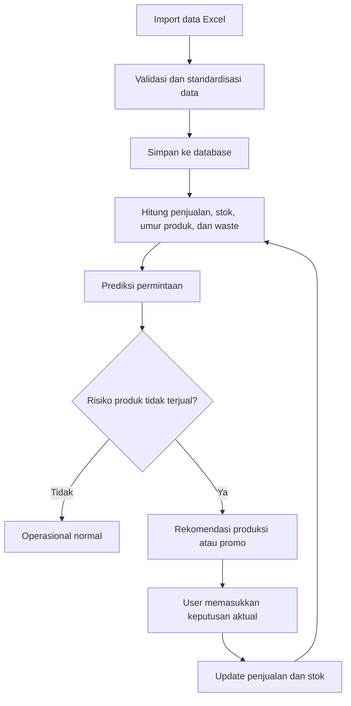
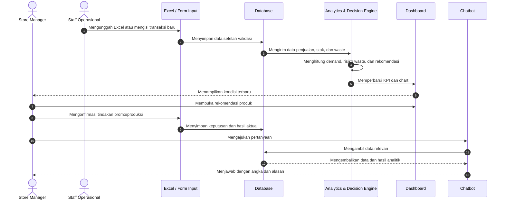

# Food Waste Prevention & Dynamic Pricing

## 1. Ringkasan Project

**Food Waste Prevention & Dynamic Pricing** adalah sistem analitik untuk membantu restoran, bakery, hotel, dan supermarket mengurangi makanan yang terbuang.

Sistem membaca data penjualan, stok, tanggal kedaluwarsa, jam operasional, promo, dan pola permintaan. Berdasarkan data tersebut, sistem memberikan rekomendasi jumlah produksi, prioritas promo, dan tindakan terhadap stok yang berisiko tidak terjual.

Fokus project ini adalah **mencegah surplus dan waste dari sisi operasional bisnis**, bukan membuat customer menunggu makanan gratis.

## 2. Tujuan

- Mengidentifikasi produk yang berisiko tidak terjual.
- Membantu menentukan jumlah produksi yang lebih sesuai dengan permintaan.
- Memberikan rekomendasi waktu dan besaran dynamic pricing/promo.
- Memantau jumlah makanan yang terselamatkan dari pembuangan.
- Membandingkan performa waste antarproduk, cabang, hari, dan jam.
- Membantu manajemen mengambil keputusan berbasis data.

## 3. Target User

- Store Manager
- Supervisor operasional
- Tim inventory
- Tim purchasing
- Tim produksi/kitchen
- Pemilik bisnis

## 4. Alur Utama



## 5. Sequence Diagram Proses Operasional



## 6. Sumber Data

### 6.1 Import Excel

Data awal dapat berasal dari file Excel dengan kolom seperti:

| Kolom | Keterangan |
|---|---|
| `transaction_id` | ID transaksi |
| `transaction_date` | Tanggal transaksi |
| `transaction_time` | Jam transaksi |
| `branch` | Nama cabang |
| `product_id` | ID produk |
| `product_name` | Nama produk |
| `category` | Kategori produk |
| `production_qty` | Jumlah produksi |
| `sold_qty` | Jumlah terjual |
| `waste_qty` | Jumlah terbuang |
| `stock_qty` | Stok tersisa |
| `unit_price` | Harga normal |
| `discount_pct` | Persentase diskon |
| `expiry_date` | Tanggal kedaluwarsa |
| `weather` | Kondisi cuaca, jika tersedia |
| `event_flag` | Penanda hari/event khusus |

### 6.2 Input Manual

User dapat memasukkan:

- Transaksi penjualan baru
- Produksi tambahan
- Produk rusak atau terbuang
- Perubahan stok
- Promo yang sedang berjalan
- Keputusan manager
- Hasil aktual setelah promo

Setiap input manual harus divalidasi sebelum masuk ke database.

## 7. Dashboard dan Chart

### KPI Utama

- Total produksi
- Total penjualan
- Total waste
- Waste rate
- Estimasi nilai kerugian
- Produk berisiko waste
- Potensi pendapatan dari promo

### Visualisasi

- Penjualan dan waste per hari
- Waste rate per produk
- Heatmap penjualan berdasarkan hari dan jam
- Top produk paling laku
- Produk slow-moving
- Stok mendekati kedaluwarsa
- Perbandingan cabang
- Prediksi demand vs realisasi
- Dampak promo terhadap penjualan

Setelah data baru disimpan, seluruh KPI dan chart harus otomatis dihitung ulang.

## 8. Decision Engine

Decision engine versi awal dapat menggunakan rule-based logic yang mudah dijelaskan.

Contoh aturan:

```text
Jika expiry_days <= 1 dan stock_qty > predicted_demand,
maka rekomendasikan promo prioritas tinggi.

Jika waste_rate > 10% selama 3 hari berturut-turut,
maka rekomendasikan pengurangan produksi.

Jika demand_actual > demand_prediction secara konsisten,
maka rekomendasikan penambahan produksi.

Jika discount_pct sudah tinggi tetapi sold_qty tetap rendah,
maka tandai produk sebagai slow-moving.
```

Setiap rekomendasi harus menampilkan:

- Masalah yang terdeteksi
- Data yang menjadi dasar
- Tingkat prioritas
- Rekomendasi tindakan
- Estimasi dampak

## 9. Chatbot

Chatbot digunakan sebagai antarmuka untuk bertanya tentang data dan rekomendasi.

Contoh pertanyaan:

- “Produk apa yang paling banyak terbuang minggu ini?”
- “Cabang mana yang memiliki waste rate tertinggi?”
- “Produk apa yang perlu diberi promo hari ini?”
- “Berapa estimasi kerugian akibat waste bulan ini?”
- “Kenapa produksi roti cokelat perlu dikurangi?”
- “Apa perbedaan performa hari kerja dan akhir pekan?”

Tahap awal chatbot dapat menggunakan pertanyaan terstruktur dan query database. Setelah data flow stabil, chatbot dapat dikembangkan menjadi chatbot AI yang tetap dibatasi pada data internal project.

## 10. Rancangan Teknologi

| Komponen | Pilihan awal |
|---|---|
| Bahasa | Python |
| Dashboard | Streamlit |
| Pengolahan data | Pandas |
| Database | SQLite |
| Chart | Plotly |
| Diagram | Mermaid |
| Forecasting | Moving average atau Prophet/LightGBM pada tahap lanjutan |
| Chatbot awal | Rule-based query assistant |
| Chatbot lanjutan | LLM dengan akses terbatas ke database |

## 11. Scope MVP

Versi pertama cukup mencakup:

1. Import satu file Excel.
2. Validasi kolom dan tipe data.
3. Penyimpanan ke SQLite.
4. Form input transaksi manual.
5. Dashboard KPI dan chart utama.
6. Deteksi produk berisiko waste.
7. Rekomendasi promo sederhana berbasis rule.
8. Sequence diagram dan flowchart project.
9. Chatbot dengan beberapa pertanyaan terstruktur.

## 12. Pengembangan Lanjutan

- Forecasting demand berdasarkan histori penjualan.
- Pengaruh cuaca dan event terhadap demand.
- Optimasi harga promo.
- Perbandingan performa antar-cabang.
- Simulasi “what if” untuk jumlah produksi dan diskon.
- Role-based access untuk manager dan staff.
- Audit trail perubahan data.
- Notifikasi stok dan expiry.

## 13. Ukuran Keberhasilan

- Data Excel berhasil diimpor tanpa duplikasi.
- Input manual langsung memperbarui database dan chart.
- Sistem dapat menemukan produk berisiko waste.
- Rekomendasi memiliki alasan yang dapat dijelaskan.
- Chatbot menjawab berdasarkan data aktual.
- Dashboard membantu membandingkan prediksi dengan hasil nyata.
- Sistem tidak hanya menampilkan chart, tetapi menghasilkan keputusan operasional.

